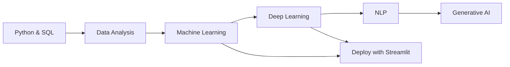

<h1 align="center">Geershati Saxena</h1>

  <b>Data Scientist · AI Engineer · Python Developer</b> 
  <i>Turning raw data into real intelligence.</i>

  
  
  
  

  <picture>
    <source media="(prefers-color-scheme: dark)" srcset="https://readme-typing-svg.demolab.com?font=JetBrains+Mono&weight=500&size=16&duration=3200&pause=800&color=59D9C6&center=true&vCenter=true&width=640&lines=Machine+Learning+%C2%B7+Deep+Learning+%C2%B7+NLP;From+notebooks+to+shipped+apps;Open+to+internships+%26+collaborations" />
    <source media="(prefers-color-scheme: light)" srcset="https://readme-typing-svg.demolab.com?font=JetBrains+Mono&weight=500&size=16&duration=3200&pause=800&color=4F46E5&center=true&vCenter=true&width=640&lines=Machine+Learning+%C2%B7+Deep+Learning+%C2%B7+NLP;From+notebooks+to+shipped+apps;Open+to+internships+%26+collaborations" />
    
  </picture>

---

## 👋 Hello

I'm a BCA graduate, now pursuing an **MCA in Data Science**. I like the space where **models meet interfaces**: training something smart, then wrapping it in a clean UI people actually enjoy using. Off-screen you'll find me on anime marathons and hunting for new indie music, usually with coffee ☕ nearby.

| | |
|:--|:--|
| 📍 **Based in** | India 🇮🇳 |
| 🎓 **Education** | BCA Graduate · MCA (Data Science) in progress |
| 📚 **Learning** | Machine Learning, Deep Learning, NLP, Generative AI |
| 🎨 **Side interest** | UI/UX design and clean interfaces |
| 🤝 **Looking for** | Internships, collaborations, open source |

---

## 🧰 Toolbox

  <picture>
    <source media="(prefers-color-scheme: dark)" srcset="https://skillicons.dev/icons?i=py,pandas,numpy,sklearn,tensorflow,pytorch,opencv,mysql,postgres,powerbi,html,css,js,git,github,vscode,figma,vercel&theme=dark&perline=9" />
    <source media="(prefers-color-scheme: light)" srcset="https://skillicons.dev/icons?i=py,pandas,numpy,sklearn,tensorflow,pytorch,opencv,mysql,postgres,powerbi,html,css,js,git,github,vscode,figma,vercel&theme=light&perline=9" />
    
  </picture>

<b>Full stack, by area</b>

 

| Area | Tools |
|:--|:--|
| **Languages** | Python, SQL, JavaScript, HTML, CSS |
| **Data & ML** | Pandas, NumPy, SciPy, Scikit-Learn, XGBoost, LightGBM |
| **Deep Learning** | TensorFlow, Keras, PyTorch, OpenCV |
| **NLP / GenAI** | NLTK, spaCy, Hugging Face |
| **Visualization & BI** | Matplotlib, Seaborn, Plotly, Power BI, Tableau, Streamlit |
| **Big data & MLOps** | Apache Spark, Dask, MLflow |
| **Databases & Dev** | MySQL, PostgreSQL, Git, GitHub, VS Code, Vercel, Jupyter |

**Comfort level**

| Skill | Level |
|:--|:--|
| 🐍 Python | ▰▰▰▰▰▰▰▰▰▱ **90%** |
| 🌐 HTML / CSS | ▰▰▰▰▰▰▰▰▱▱ **85%** |
| 🗄️ SQL | ▰▰▰▰▰▰▰▰▱▱ **85%** |
| ⚡ JavaScript | ▰▰▰▰▰▰▰▱▱▱ **75%** |
| 🔧 Scripting & automation | ▰▰▰▰▰▰▰▱▱▱ **70%** |

---

## 🚧 On My Desk

| Project | Built with | Status |
|:--|:--|:--|
| 🤖 **AI-powered web app** | Python · Streamlit · Scikit-Learn | ▰▰▰▰▰▰▰▰▱▱ 75% |
| 📊 **Interactive dashboard** | Plotly · Pandas · SQL | ▰▰▰▰▰▰▰▱▱▱ 65% |
| 🧠 **Deep learning model** | TensorFlow · NumPy | ▰▰▰▰▰▱▱▱▱▱ 50% |
| 🌐 **Portfolio website** | HTML · CSS · JavaScript | ▰▰▰▰▰▰▰▰▰▱ 85% |

---

## 🗺️ Learning Path

---

## 📊 By the Numbers

  <picture>
    <source media="(prefers-color-scheme: dark)" srcset="https://github-stats-extended.vercel.app/api?username=geershatisaxena&theme=tokyonight&show_icons=true&hide_border=true&include_all_commits=true&count_private=true" />
    <source media="(prefers-color-scheme: light)" srcset="https://github-stats-extended.vercel.app/api?username=geershatisaxena&theme=default&show_icons=true&hide_border=true&include_all_commits=true&count_private=true" />
    
  </picture>
  <picture>
    <source media="(prefers-color-scheme: dark)" srcset="https://github-stats-extended.vercel.app/api/top-langs/?username=geershatisaxena&layout=compact&theme=tokyonight&hide_border=true&langs_count=8" />
    <source media="(prefers-color-scheme: light)" srcset="https://github-stats-extended.vercel.app/api/top-langs/?username=geershatisaxena&layout=compact&theme=default&hide_border=true&langs_count=8" />
    
  </picture>

  <picture>
    <source media="(prefers-color-scheme: dark)" srcset="https://github-readme-streak-stats-eight.vercel.app?user=geershatisaxena&theme=tokyonight&hide_border=true&background=0D1117" />
    <source media="(prefers-color-scheme: light)" srcset="https://github-readme-streak-stats-eight.vercel.app?user=geershatisaxena&theme=default&hide_border=true&background=FFFFFF" />
    
  </picture>

  <a href="https://leetcode.com/u/geershati_saxena/">
    <picture>
      <source media="(prefers-color-scheme: dark)" srcset="https://leetcard.jacoblin.cool/geershati_saxena?theme=dark&ext=heatmap" />
      <source media="(prefers-color-scheme: light)" srcset="https://leetcard.jacoblin.cool/geershati_saxena?theme=light&ext=heatmap" />
      
    </picture>
  </a>

<b>More activity</b> (contribution graph, trophies, snake)

 

  <picture>
    <source media="(prefers-color-scheme: dark)" srcset="https://github-readme-activity-graph.vercel.app/graph?username=geershatisaxena&theme=react-dark&hide_border=true&area=true&bg_color=0D1117" />
    <source media="(prefers-color-scheme: light)" srcset="https://github-readme-activity-graph.vercel.app/graph?username=geershatisaxena&theme=github-compact&hide_border=true&area=true&bg_color=FFFFFF" />
    
  </picture>

  <picture>
    <source media="(prefers-color-scheme: dark)" srcset="https://github-profile-trophy.vercel.app/?username=geershatisaxena&theme=tokyonight&no-frame=true&row=1&column=7&margin-w=10" />
    <source media="(prefers-color-scheme: light)" srcset="https://github-profile-trophy.vercel.app/?username=geershatisaxena&theme=flat&no-frame=true&row=1&column=7&margin-w=10" />
    
  </picture>

  <picture>
    <source media="(prefers-color-scheme: dark)" srcset="https://raw.githubusercontent.com/Platane/snk/output/github-contribution-grid-snake-dark.svg" />
    <source media="(prefers-color-scheme: light)" srcset="https://raw.githubusercontent.com/Platane/snk/output/github-contribution-grid-snake.svg" />
    
  </picture>

---

## 🤝 Let's Build Something

If you're working on data, ML, or a product that needs a bit of intelligence, I'd love to chat.

  &nbsp;&nbsp;
  &nbsp;&nbsp;
  &nbsp;&nbsp;
  &nbsp;&nbsp;
  &nbsp;&nbsp;
  &nbsp;&nbsp;
  &nbsp;&nbsp;
  

  

Thanks for stopping by. A ⭐ is always appreciated.

